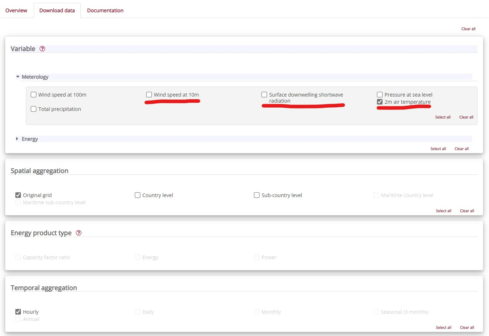
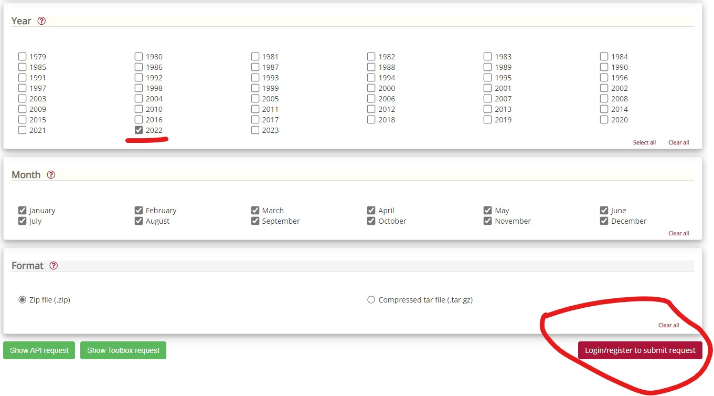

# Swiss solar and wind electricity production model

This project aims to modeling the Swiss solar and wind electricity production using climatic data from
the Copernicus Climate Change Service information [CDS](https://cds.climate.copernicus.eu/), electricity
plants map from the Swiss Federal Office of Energy [SFOE](https://www.bfe.admin.ch/bfe/fr/home.html) and 
estimated electricity production data provided by [Pronovo](https://pronovo.ch/fr/services/rapports-et-publications/) 
and [EnergyCharts](https://www.energy-charts.info/charts/energy/chart.htm?l=fr&c=CH&chartColumnSorting=default).

It has been made to be used with [EcoDynElec](https://github.com/LESBAT-HEIG-VD/EcoDynElec), a tool allowing to compute 
the hourly carbon footprint of the Swiss electricity mix.

You can reproduce and tune the model by taking example on the example.ipynb notebook, or you can directly use the results
stored in the `ecd_enr_model/export/enr_prod_2017-2022.csv` file :
    
```python
import pandas as pd
from ecodynelec_enr_model import data_loading

enr_prod_all = pd.read_csv(f'{data_loading.root_dir}export/enr_prod_2017-2022.csv', index_col=0, parse_dates=[0])
```

## How to download the required data

### Climatic data

The climatic data are downloaded from the [Climate and energy indicators for Europe from 1979 to present derived from reanalysis](https://cds.climate.copernicus.eu/cdsapp#!/dataset/10.24381/cds.4bd77450?tab=overview) dataset.

Go on the link below, then under the "Download data" tab, select **one** on the following variables (there is a limit on how much data you can
download at once):

Continue with selecting the time period (**one** year at once):

Then download as a zip file. You must be logged with a cds account.

The downloaded data must then be unzipped and placed in the `ecd_enr_model/2m_temperature_2022` folder (for this example).

### Electricity plants map

The electricity plants map can be downloaded from https://opendata.swiss/fr/dataset/elektrizitatsproduktionsanlagen. 
It is the csv file `CH_ElectricityProductionPlant_final` in the ecd_enr_model folder.

### Pronovo data

The pronovo data can be found on [Pronovo](https://pronovo.ch/fr/services/rapports-et-publications/), under the "Profils courbe de charge selon technologies" section.

### EnergyCharts data

The EnergyCharts data is downloaded from [EnergyCharts](https://www.energy-charts.info/charts/energy/chart.htm?l=fr&c=CH&chartColumnSorting=default):

